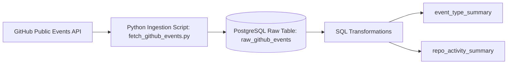
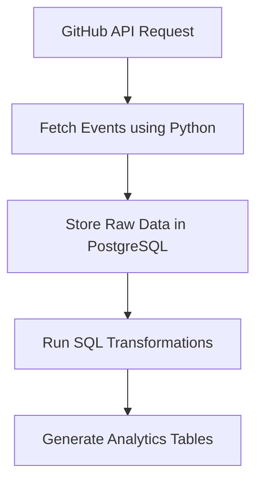

# GitHub Events Batch ETL Pipeline

A simple Data Engineering ETL pipeline that collects GitHub public events using the GitHub API, stores raw event data in PostgreSQL, and transforms it into analytics tables using SQL.

## Overview

This project builds a batch data pipeline that:
- fetches GitHub public events from the GitHub API
- stores raw data in PostgreSQL
- transforms raw data into analytics tables using SQL

## Architecture

## Pipeline Flow

## Technologies Used

- Python
- PostgreSQL
- SQL
- GitHub API
 analytics tables

