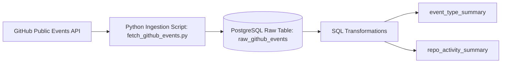

# GitHub Events Batch ETL Pipeline Architecture

```mermaid
flowchart LR
    A[GitHub Public Events API] --> B[Python Ingestion Script: fetch_github_events.py]
    B --> C[(PostgreSQL Raw Table: raw_github_events)]
    C --> D[SQL Transformations]
    D --> E[event_type_summary]
    D --> F[repo_activity_summary]
```
